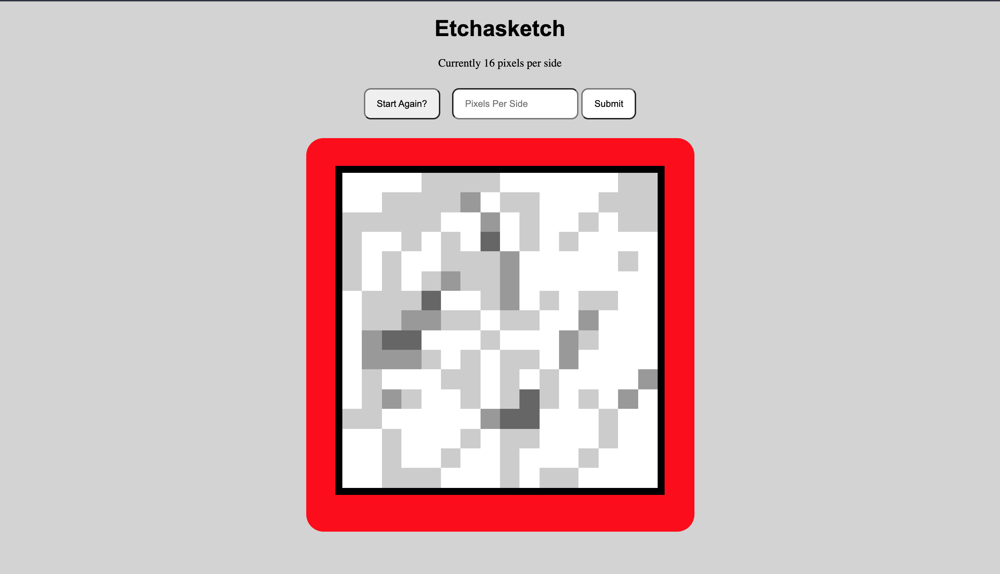

## Etchasketch 

- Etchasketch made as part of The Odin Projects Curriculum. Learning objectives were looking at the DOM interaction, event triggering, bubbling and CSS Grid. 

[Live Site](https://phileeep.github.io/etchasketch/)

